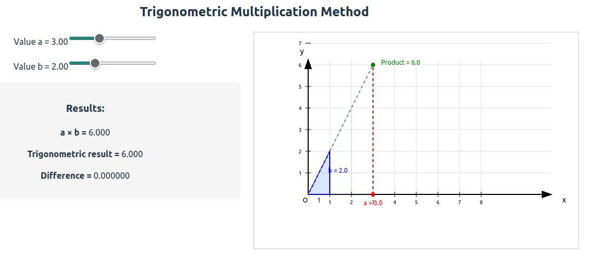

# Trigonometric Multiplication Method

## Overview

This project demonstrates a geometric approach to multiplication using trigonometric relationships and similar triangles.

## Core Principle

The method uses the formula: `product = a / tan(asin(1 / √(1 + b²)))`

Instead of traditional arithmetic, multiplication is performed through geometric construction:

1. **Reference Triangle**: Create a right triangle with base=1, height=b, hypotenuse=√(1+b²)
2. **Key Angle**: Extract angle α where sin(α) = 1/√(1+b²), therefore tan(α) = b
3. **Scaling**: Extend the hypotenuse line to distance 'a' on x-axis
4. **Result**: The y-coordinate at intersection gives a×b

## Why This Works

The method leverages similar triangles - all triangles along the extended hypotenuse maintain the same angle α, creating a geometric multiplication through proportional scaling.

## Applications

- **Analog Computing**: Potentially faster than digital for high-precision operations
- **Optical Systems**: Laser beam intersections on the theoretically infinity space
- **Electronic Implementation**: CRT-style deflection coils for rapid positioning at least for the first beam.



## Interactive visualization

The interactive demo shows how the geometric relationship scales across multiple similar triangles, demonstrating the mathematical elegance of trigonometric multiplication.  
  
1. Update nvm
```
curl -o- https://raw.githubusercontent.com/nvm-sh/nvm/v0.40.1/install.sh | bash
```
2. Update node
```
nvm install 20
nvm use 20
```
3. Create Vite project
```
npm create vite@latest trig-visualizer -- --template react
cd trig-visualizer
npm install
```
4. Replace App.jsx
```
rm src/App.jsx
cp ../App.jsx src/
```
5. Run:
```
npm run dev
```
6. Browse:
[http://localhost:5173](http://localhost:5173)

## Research Background

This idea originally came to me while working on the [AVAX password crack problem using GPU computing](https://github.com/format37/avax-pw-crack.git), which requires operations with large hexadecimal numbers and involves research into advanced multiplication methods such as Strassen and Karatsuba algorithms. The geometric approach to multiplication presented here offers an alternative perspective that could potentially be leveraged in specialized computing scenarios. 